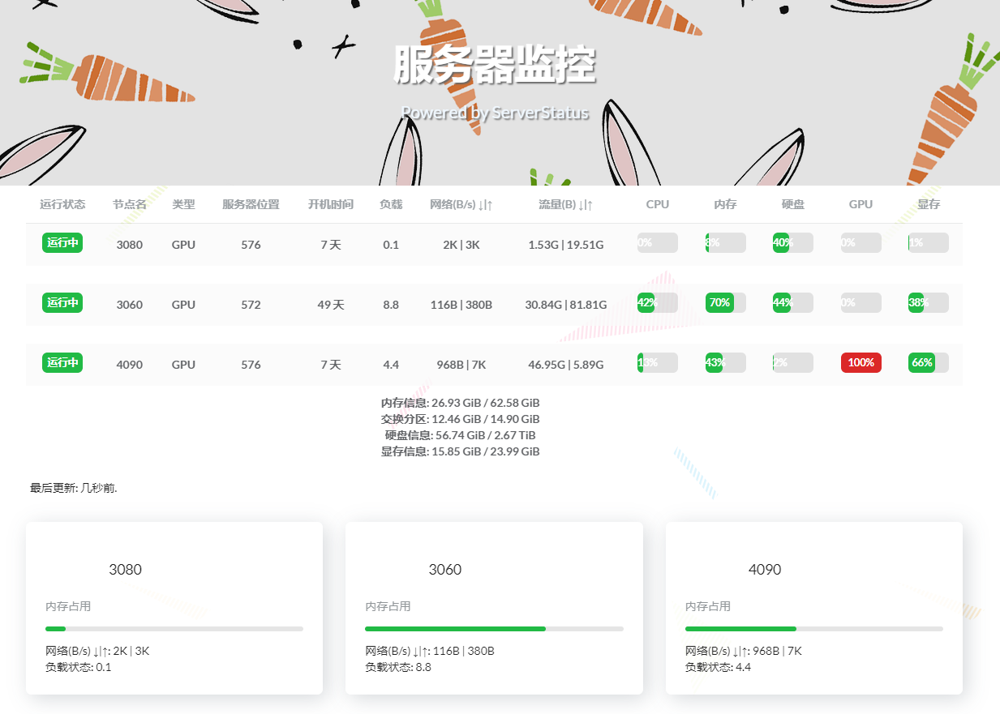

# ServerStatus_for_DeepLearning

多服务器/工作站云监控，支持CPU/GPU/内存/显存/硬盘等状态实时监测

查看实验室服务器的工作状态，解放你查询各种命令的双手，或者找到实验室的卷王，并kill掉他的进程（不是


示例：


增加了对显卡状态的监测，去掉了科研环境不需要的检测项目

Based on [ServerStatus-Hotaru](https://github.com/cokemine/ServerStatus-Hotaru) 
& 前端基于 [Hotaru_theme](https://github.com/cokemine/hotaru_theme)
## 特性

服务端客户端支持系统：Centos 7、Debian 8、Ubuntu 15.10 及以上、ArchLinux

Python 客户端：支持 Python 版本：Python 2.7+

## 安装方法

服务端：

```bash
cd ./ServerStatus-Hotaru-master/server 
make #编译生成二进制文件 
chmod +x sergate
./server/sergate --config=./server/config.json --web-dir=./ServerStatus/web --port=35601 > /tmp/serverstatus_server.log 2>&1 & #默认端口35601
```

客户端：

打开 status-client.py 配置如下信息
```python
#打开 status-client.py 配置如下信息
SERVER = "127.0.0.1"
PORT = 35601
USER = "USER"
PASSWORD = "USER_PASSWORD"
INTERVAL = 1  # 更新间隔，单位：秒
```
使用 Psutil 版客户端即可使 ServerStatus 客户端在 Windows 等其他平台运行

```powershell
curl https://bootstrap.pypa.io/get-pip.py -o get-pip.py # 若未安装pip
python get-pip.py
python pip install psutil
# 修改 status-client.py
python status-client.py
```

Linux 版客户端支持绝大部分 Linux 发行版系统，一般不需要使用 psutil 版客户端。

```bash
apt install python3 python3-pip wget
pip3 install psutil
vim status-psutil.py #修改客户端配置文件
python3 status-psutil.py
# https://raw.githubusercontent.com/cokemine/ServerStatus-Hotaru/master/clients/status-client.py 默认版本无需 psutil 依赖
```

## 添加/修改服务器

只需编辑 config.json 文件: ./ServerStatus/server/config.json 

```json
{
   "username": "Name",
   "password": "Password",
   "name": "Your Servername",
   "type": "GPU/CPU",
   "host": "None",
   "location": "Your Lab",
   "disabled": false
},
```

然后重启 ServerStatus

## 使用Web页面
```bash
#安装caddy
sudo apt install -y debian-keyring debian-archive-keyring apt-transport-https
curl -1sLf 'https://dl.cloudsmith.io/public/caddy/stable/gpg.key' | sudo gpg --dearmor -o /usr/share/keyrings/caddy-stable-archive-keyring.gpg
curl -1sLf 'https://dl.cloudsmith.io/public/caddy/stable/debian.deb.txt' | sudo tee /etc/apt/sources.list.d/caddy-stable.list
sudo apt update
sudo apt install caddy
#立即启动web server
cd ServerStatus/web/hotaru_theme/public/index.html
caddy file-server --listen [:Your Port]

```
[更多caddy使用方法](https://caddyserver.com/)
## 感谢
* jq: https://github.com/stedolan/jq CC BY 3.0 License
* caddy: https://github.com/caddyserver/caddy Apache-2.0 License

